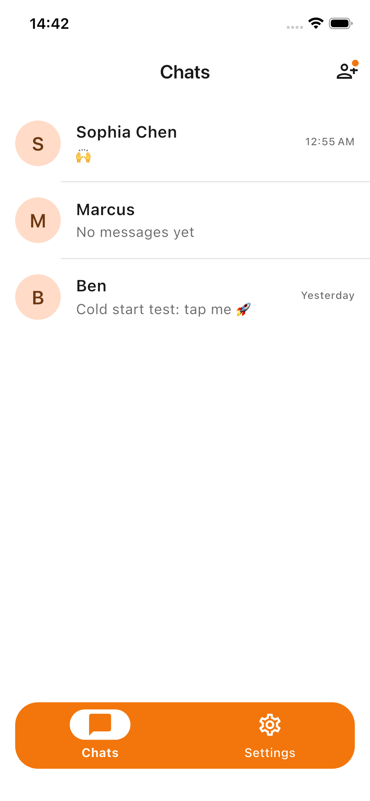
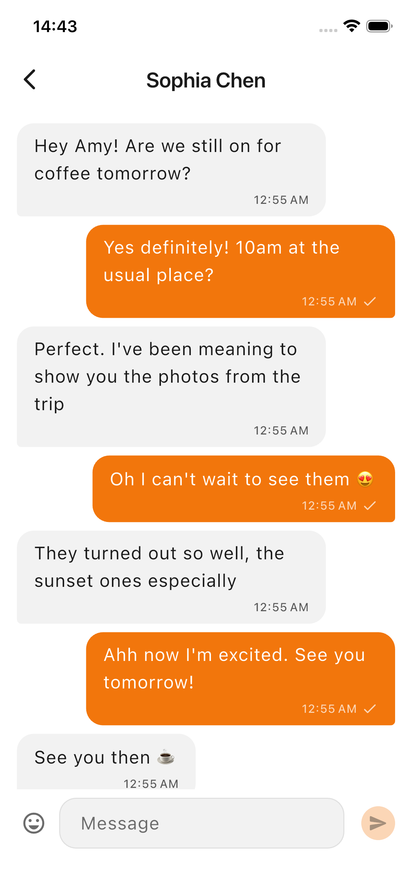
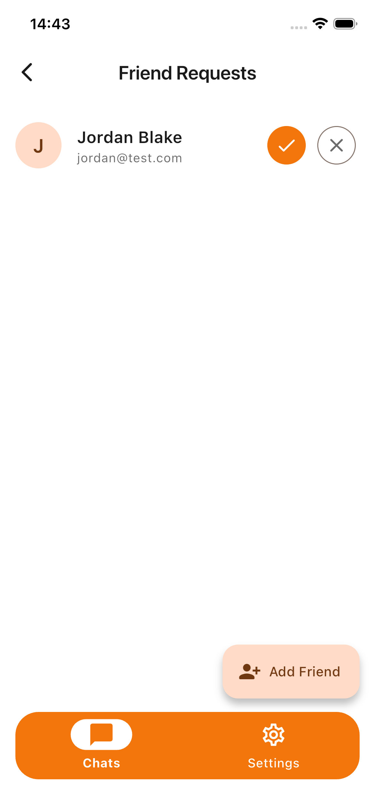
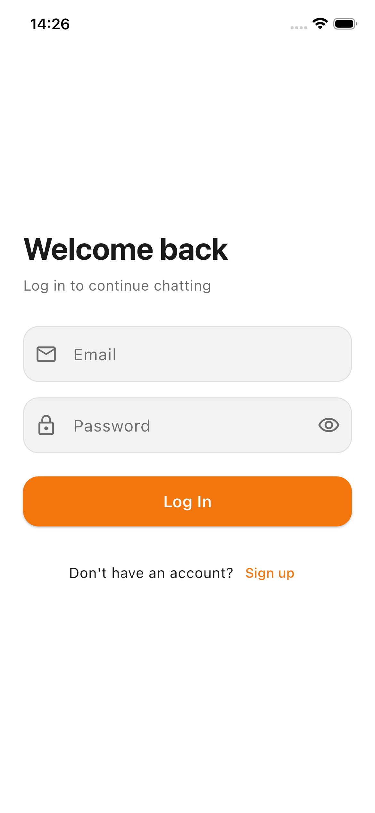
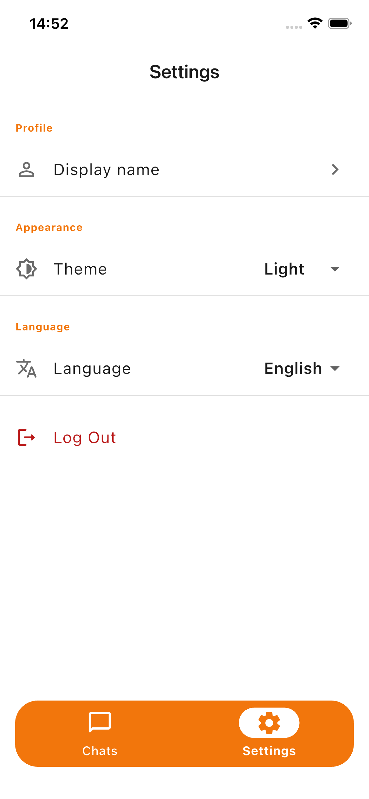
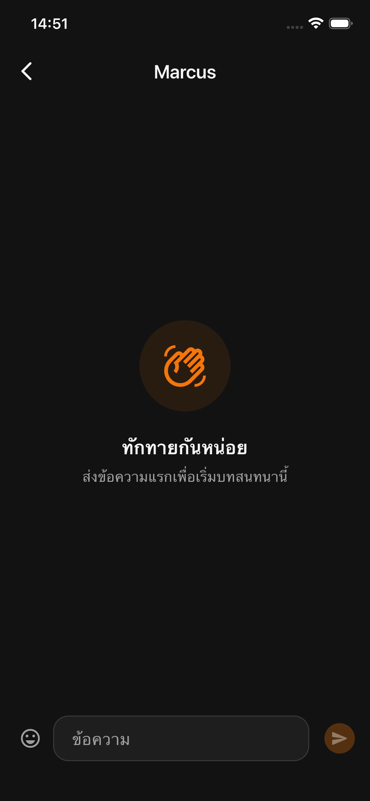

# Chat App

[](https://github.com/karansnarula/chat-app/actions/workflows/ci.yml)


A real-time messaging app built with Flutter — friends, one-on-one
conversations, live delivery over WebSocket, and push notifications. It
consumes a custom [NestJS backend](https://github.com/karansnarula/chat-app-api)
deployed on Render.

Built as a portfolio piece: clean architecture, Bloc throughout, a typed
`Result` error model, full localization (English + Thai), light/dark themes,
and a CI pipeline that ships every push to testers via Firebase App
Distribution.

## Screenshots

| Chats | Conversation | Friend Requests |
|:---:|:---:|:---:|
|  |  |  |

| Login | Settings | Dark mode |
|:---:|:---:|:---:|
|  |  |  |

## Features

- **Authentication** — email/password sign-in and registration, JWT access +
  refresh tokens with transparent renewal on 401, session restored on relaunch.
- **Friends** — add by email, accept/decline incoming requests, with a live
  indicator on the chats screen when requests are pending.
- **Conversations** — one-on-one chats with cursor-paginated history, optimistic
  sending (a failed message becomes a tap-to-retry bubble), read receipts, date
  separators, and an emoji picker in the composer.
- **Real-time** — a single authenticated WebSocket delivers incoming messages,
  read receipts, and friend requests; screens update without a refresh.
- **Push notifications** — FCM while backgrounded or terminated, local
  notifications while foregrounded on another screen, and tap-to-open the right
  conversation including from a cold start.
- **Settings** — theme (system/light/dark), language (system/English/Thai), edit
  display name, and logout — all persisted.
- **Resilience** — offline banner, connection status, and graceful error/retry
  states throughout.

## Architecture

Clean architecture, feature-first. Each feature is split into three layers:

```
lib/
├── core/       constants, error, network, storage, router, theme, l10n, di, widgets, notifications
└── features/<feature>/
    ├── data/          models (DTOs), datasources (retrofit / local), repository impls
    ├── domain/        entities, repository interfaces, use cases
    └── presentation/  bloc, screens, widgets
```

**Key decisions**

- **Bloc everywhere**, `events → bloc → Equatable states`. Screens dispatch
  events and render states; no logic in widgets.
- **Uniform use cases** in every feature. A few orchestrate real work (login
  connects the socket and registers for push); most are thin, kept for a
  consistent structure and a uniform mocking seam in tests.
- **Typed errors with `Result<T>`** — a sealed `Success`/`Failure` returned by
  repositories and use cases, handled with exhaustive `switch`. A single
  `guard()` is the only `try/catch`, converting transport exceptions into typed
  failures. Exceptions never leak past the data layer.
- **Cross-feature communication through repository-exposed streams**, never
  bloc-to-bloc. The WebSocket service exposes typed streams; repositories
  re-expose them; any bloc subscribes to what it needs.
- **The socket is an enhancement, not a dependency** at the architecture level —
  it is opened once per session, disconnected on background so the backend's FCM
  fallback fires, and reconnects with a token refresh.
- **No hard-coded values** — colours, spacing, radii, font sizes, and durations
  live in `core/constants/`; every user-facing string is localized.

## Tech stack

| Concern | Choice |
|---|---|
| State management | `flutter_bloc`, `equatable` |
| Routing | `go_router` (auth-aware redirect, stateful shell) |
| DI | `get_it` + `injectable` |
| Networking | `dio` + `retrofit`; interceptor attaches the token and refreshes on 401 |
| Real-time | `socket_io_client` |
| Storage | `flutter_secure_storage` (tokens), `shared_preferences` (settings) |
| Push | `firebase_messaging` + `flutter_local_notifications` |
| Localization | `flutter_localizations` + gen-l10n (English, Thai) |
| Testing | `bloc_test`, `mocktail`, `integration_test` |
| Tooling | `very_good_analysis`, GitHub Actions, Firebase App Distribution |

## Getting started

Flutter is pinned to **3.44** (managed here with [fvm](https://fvm.app)).

```sh
flutter pub get
flutter gen-l10n
dart run build_runner build --delete-conflicting-outputs   # DI, retrofit, json
flutter run
```

Generated files (`*.g.dart`, `*.config.dart`, the l10n output) are not
committed; regenerate them after checkout. The app points at the deployed
backend by default; override with `--dart-define=API_BASE_URL=...` to run
against a local one.

```sh
flutter test    # unit, bloc, and widget tests
flutter analyze # very_good_analysis, kept clean
```

## Continuous integration

Every push and PR to `develop`/`main` runs code generation, `flutter analyze`,
the test suite, and a release build. Pushes to `develop` additionally distribute
the Android build to testers through Firebase App Distribution.

## Known limitations

- **iOS push notifications** require a paid Apple Developer account for an APNs
  key; registration fails softly on iOS, and the rest of the app is unaffected.
  The FCM path is exercised and verified on Android.
- A few **backend-side items** are documented rather than worked around: the
  REST `POST /messages` path stores without notifying (the app sends over the
  socket, which does notify), and a declined friend request currently blocks a
  fresh one between the same pair.

---

Backend: [chat-app-api](https://github.com/karansnarula/chat-app-api) ·
Built by [Karan Singh Narula](https://github.com/karansnarula)
